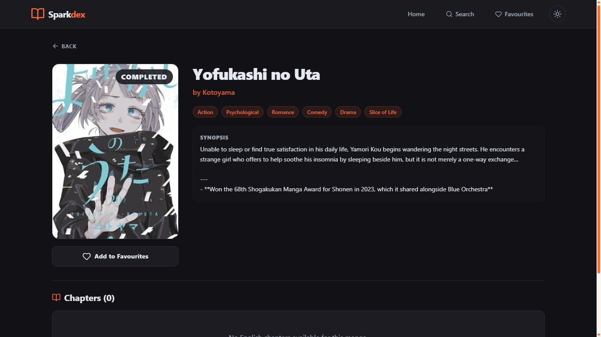
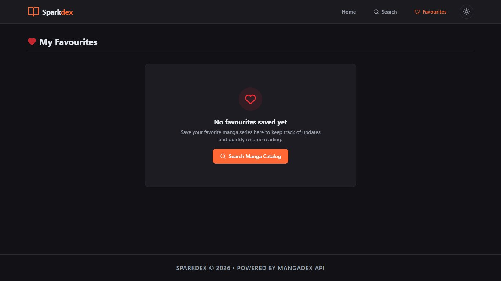

# 📚 Sparkdex — Read Manga Online

> A free, fast, and ad-free manga reader powered by the MangaDex API.


---

## 🌐 Live Demo

🔗 **[sparkdex.kesug.com](https://sparkdex.kesug.com)**

---

## 📸 Screenshots

### 🏠 Home — Dark Mode


### 🏠 Home — Light Mode


### 🔍 Search


### 📖 Manga Detail


### ❤️ Favourites


---

## ✨ Features

- 🔥 **Popular Manga** — Browse trending titles from the MangaDex catalog
- 🕐 **Recently Updated** — Infinite scroll feed of the latest chapter uploads
- 🔍 **Search** — Find manga by title with genre and status filters
- 📖 **Chapter Reader** — Vertical scroll and horizontal page-flip reading modes
- ❤️ **Favourites** — Save your favourite manga locally
- 🌙 **Dark / Light Mode** — Toggle between themes
- 📱 **Fully Responsive** — Works on desktop and mobile

---

## 🛠️ Tech Stack

| Layer | Technology |
|---|---|
| Frontend | React 18 + Vite 8 |
| Styling | Tailwind CSS |
| Backend | Node.js + Express |
| API | MangaDex API v5 |
| Hosting (Frontend) | InfinityFree |
| Hosting (Backend) | Render |

---

## 📁 Project Structure

```
sparkdex/
├── frontend/               # React + Vite frontend
│   ├── src/
│   │   ├── components/     # Reusable UI components
│   │   │   ├── MangaCard.jsx
│   │   │   ├── Navbar.jsx
│   │   │   └── SkeletonLoader.jsx
│   │   ├── context/        # React context providers
│   │   │   ├── FavouritesContext.jsx
│   │   │   ├── ThemeContext.jsx
│   │   │   └── ToastContext.jsx
│   │   ├── pages/          # Page components
│   │   │   ├── Home.jsx
│   │   │   ├── Search.jsx
│   │   │   ├── MangaDetail.jsx
│   │   │   ├── Reader.jsx
│   │   │   ├── Favourites.jsx
│   │   │   └── NotFound.jsx
│   │   └── utils/
│   │       └── mangadex.js # MangaDex data helpers
│   └── package.json
├── server/                 # Express proxy backend
│   └── index.js
└── package.json            # Root config (concurrently)
```

---

## 🚀 Running Locally

### Prerequisites
- Node.js 18+
- npm

### Steps

```bash
# Clone the repository
git clone https://github.com/Sparkx-exe/sparkdexweb.git
cd sparkdexweb

# Install all dependencies
npm run install-all

# Start both frontend and backend
npm run dev
```

The app will be available at:
- Frontend: `http://localhost:5173`
- Backend: `http://localhost:3001`

---

## 🌍 Deployment

### Frontend → InfinityFree
```bash
cd frontend
npm run build
# Upload contents of dist/ to htdocs/ on InfinityFree
```

Add this `.htaccess` to `htdocs/` for React Router support:
```apache
RewriteEngine On
RewriteBase /
RewriteRule ^index\.html$ - [L]
RewriteCond %{REQUEST_FILENAME} !-f
RewriteCond %{REQUEST_FILENAME} !-d
RewriteRule . /index.html [L]
```

### Backend → Render
1. Connect your GitHub repo to [Render](https://render.com)
2. Set **Root Directory** to `server`
3. Set **Start Command** to `node index.js`
4. Deploy!

---

## 📡 API

The backend is a lightweight Express proxy that forwards requests to the MangaDex API:

```
GET /api/*        → https://api.mangadex.org/*
GET /image/*      → Proxies manga cover and chapter images
GET /health       → Health check endpoint
```

---

## 📜 License

This project is open source and available under the [MIT License](LICENSE).

---

## 🙏 Credits

- Manga data provided by [MangaDex API](https://api.mangadex.org)
- Built with ❤️ by [Sparkx-exe](https://github.com/Sparkx-exe)
